# Southeast Feasts - Milestone Project 3

[View the live project here.](https://southeast-feasts.herokuapp.com/home)

## Project Overview

The Project goal is to create a data orientated website to allow the user to find and share recipes with other users. The theme of the website is specifically targeted to an audience interested in South East Asian Cuisine.

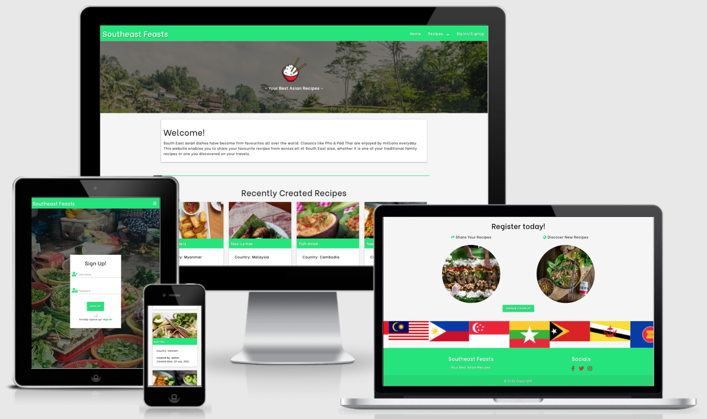

## Project Goals

* The Website must be fully responsive on all devices.
* To allow the user to find and share recipes.
* Clear design presentation which allows the the user to navigate easily.
* To maximise future maintainability through documentation, code structure and organisation.
* To allow the user to add, edit and delete recipes through their profile page (CRUD functionality).
* Admin user will have full visibility of recipes added from other users and will be able to perform CRUD operations on these recipes also.
* To allow users to search for specific recipes whether that be by Country, ingredient or recipe name.
* The target users will be for anyone interested in South East Asian Cuisine.

## User Stories

### New Users:

* As a new user what service does this website provide?
* As a new user how do I register?
* As a new user how do I discover new recipes by country?
* As a new user how do I search for specific recipes?
* As a new user how do I find ingredients list and method to cook the recipe?

### Existing Users:

* As an existing user how do I log into my account?
* As an existing user how do I view my profile?
* As an existing user how do I share a new recipe?
* As an existing user how do I edit an existing recipe?
* As an existing user how do I delete an existing recipe?
* As an existing user how do I view my own recipes that I've added?

## Design

### 1. Colour Scheme
* A materalize tropical green - (green accent-4) has been used as the main background color for the Navbar, Footer, font awesome icons & buttons as asian cuisine has often vibrant greens in the cuisine so ties in with the theme. 
* For the hr the same color green has been used to seperate content.
* For the recipe cards the same color green has been used for the background color for the recipe name to make the recipe stand out with a white text and text shadow.
* For the base background color a materlaize light grey (grey lighten-4) has been used so all text is easy to read.

### 2. Typography
* The font style of Be Vietnam has been chosen for all font across the website. The letterforms are clean, modern and straightforward.
* All font has a letter spacing of 0.05em to make it easier to read.
* The fallback fonts across all webpages is sans serif for any reason the main fonts do not import correctly.

### 3. Imagery
* Home Page - Home Banner at the top of the page of some rice terraces in Indonesia. The greens of the image blend nicely with the materalize green in the Nav Bar to suit the theme. Also rice is a staple across South East Asia so ties in with the recipe theme.
* Recipe Cards - Image for each recipe shown on recipe cards by inputing the URL when adding a new recipe. Can also Zoom onto the image on click to take a closer look.
* Home Page - Share recipe image shows people sharing a dish which links to the signup/signin page, If session user is logged in will take you to add recipe page.
* Home Page - Discover recipe image takes you to all recipe page.
* Home Page - Materalize Carousel displays country flags for South East Asian Countrys above the footer which fits the theme of the website.
* Recipes Page - Depending on which country is selected the appropriate flag will display in the heading.
* SignIn/Sign Up Page - Full Screen background image of a local market it Vietnam with plenty of fresh ingredients. Fits in with the theme of the website.
* Add/Edit Recipe Page - Full Screen background image of a hot chilli peppers displayed as asian cuisine often is spicy so fits in with the theme.

### 4. Icons
* Various Font Aewsome icons displayed across the entire site depending on which field you are filling in / which information is being displayed.[Font Awesome](https://fontawesome.com/v4.7.0/).

## WireFrames

Initial Wireframe designs made on Figma:

* [Southeast Feasts Wireframe Collection](static/readme-docs/wireframes/southeast-feasts.pdf)

Final design similar to original design. Decided to leave out the Newsletter sign up section on the home page.

## Features / User Stories Testing

* Home Page(index.html)
    * Materalize NavBar when new user only Home, Recipes & SignIn/SignUp will display. Therefore a new user to can take a look at the recipes available and sign up if they so choose. - **As a new user how do I register?**
    * Welcome Section - a small paragraph explaining the purpose of the website. This meets the requirement of the user story - **As a new user what service does this website provide?**
    * Recently created recipes section - The 4 most recently created recipes, by clicking the the card panel the recipe description will be displayed showing ingredients, method and additional info.
    * Share & Discover Section - Links to add a new recipe or sign up depending if you are signed in or not by session user. Discover image takes to to all recipe page.
    * Materlaize Carousel - displaying South Eastern Asian flags. Custom Jquery also added on top of Materalize initiatiation.
    * Footer - Social Font Awesome Links
    
* Recipes Page (recipes.html)
    * Displays recipes by country by the Navbar dropdown, this will also display appropriate flag within heading. - **As a new user how do I discover new recipes by country?**
    * Search functionality will allow the user to search by either recipe Name, country or ingredient. - **As a new user how do I search for specific recipes?**
    * By resetting the search button this will send the user back to all recipes.
    * Link to recipe description by clicking card panel (recipe.html). Image on Card panel will allow the user to take a closer look at the recipe image. - **As a new user how do I find ingredients list and method to cook the recipe?**

* Sign In/ Sign Up Pages (signin.html/signup.html)
    * Sign In Page allows an existing user to sign in via a username & Password. - **As an existing user how do I log into my account?**
    * Sign Up Page allows a new user to register to create an account with new username and password. - **As a new user how do I register?**

* Sign In/ Sign Up Pages (signin.html/signup.html)
    * Sign In Page allows an existing user to sign in via a username & Password. - **As an existing user how do I log into my account?**
    * Sign Up Page allows a new user to register to create an account with new username and password. - **As a new user how do I register?**
    * When user is logged in/registered Home, Recipes, Profile & Add Recipe will be displayed in Navbar as session user is logged in.

* Profile Page (profile.html)
    * If session user is admin all recipe cards will be displayed otherwise will show appropriate Recipe Cards for session user. - **As an existing user how do I view my own recipes that I've added?**
    * Edit functionality within recipe cards on profile page to edit recipe. - **As an existing user how do I edit an existing recipe?**
    * Delete functionality within recipe cards on profile page to delete recipe. Modal pop up when delete button clicked as additional security function. **As an existing user how do I delete an existing recipe?**

* Recipe Description (recipe.html)
    * Upon clicking any recipe cards through the website the recipe decription will be displayed and all manner of infomation will be available such as Ingredients & Method of Cooking. - **As a new user how do I find ingredients list and method to cook the recipe?**

* Add recipe (add_recipe.html)
    * Add recipe within the Navbar will allow the session user to add a new recipe. - **As an existing user how do I share a new recipe?**
    * All fields are required with some having min/max lengths for each field.
    * Tooltipped info pop ups next to some fields explaing what is required.

* Edit recipe (edit_recipe.html)
    * Edit recipe accessed via profile page which will take you to the edit recipe page. - **As an existing user how do I edit an existing recipe?**
    * All fields will be prefilled with current entry from mongodb.
    * Tooltipped info pop ups next to some fields explaing what is required.

* Other Features
    * Responsive on all devices
    * All fields required on edit/add recipe page.
    * Pop up Modal for delete button as extra security feature.
    * Defensive programming used across website so can only access certain sections of the site if you are signed in or not.
    * Custom Jquery so Carousel works approriately.
    * Flash messages showing feedback on actions.
    * Jquery Validation code for select field added as explained in Backend Mini Project.

* Security Features
    * Werkzseug security used to store secure passwords with salted hashes and later we will verify entered user password in plaintext against it's password hash to authenticate user.
    * Debug set to false so code not visible if there is an error within the application. 403, 404 & 500 error pages also included.

* Features left to implement
    * Pagination for recipes page when more than 8 recipe cards are displayed (beyond my scope of kn owledge right now).
    * Newsletter sign up on home page via email js.
    * Review section to be able to leave comments/rating for recipes viewed when logged in.
    
### Languages Used

* [HTML5](https://en.wikipedia.org/wiki/HTML5)
* [CSS3](https://en.wikipedia.org/wiki/CSS)
* [Javascript](https://en.wikipedia.org/wiki/JavaScript) 
* [Python3](https://en.wikipedia.org/wiki/Python_(programming_language))

### Frameworks, Libraries & Programs Used

1. [Materalize](https://materializecss.com/)
    * Materalize was used to assist with the responsiveness across the entire website.
2. [Google Fonts](https://fonts.google.com/)
    * Google fonts were used to import the 'Be Vietnam' font into the style.css file.
3. [Font Awesome](https://fontawesome.com/)
    * Font Awesome was used to add icons for aesthetic and UX purposes.
4. [JQuery](https://jquery.com/)
    * jQuery used for certain Javascript functions using the materlize initialisation.
5. [Gitpod](https://www.gitpod.io/)
    * The Interactive Development Envvironment to code the website. Git was used for version control by utilizing the Gitpod terminal to commit to Git and Push to GitHub.
6. [Github](https://github.com/)
    * GitHub is used to store the projects code after being pushed from Git.
7. [Figma](https://www.figma.com/)
    * This was used to create my wireframe designs for desktop/mobile formats.
8. [Chrome Dev Tools](https://developer.chrome.com/docs/devtools/)
    * To assist with debugging code and assessing perforamnce through lighthouse.
9. [FavIcon](https://favicon.io/favicon-generator/)
    * Used to make custom Icon for website.
13. [AmIResponsive](http://ami.responsivedesign.is/)
    * Used to created mock up of website.
14. [TinyPNG](https://tinypng.com/)
    * Used to compress images to increase performance.
14. [Flask](https://en.wikipedia.org/wiki/Flask_(web_framework))
    * Micro Web Framework
14. [MongoDB](https://en.wikipedia.org/wiki/MongoDB)
    * Database used for the application. MongoDB is a source-available cross-platform document-oriented database program.
14. [Heroku](https://en.wikipedia.org/wiki/Heroku)
    * Used to deploy my project.

## Database schema

* MongoDB is the cloud based database service used for the project.
* There is 2 collections used for the project:
    * recipes
    * users

The database structure for recipes is as follows:
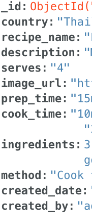

The database structure for users is as follows:
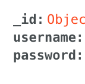

* When adding a recipe the created by field will take the data from the session user using the username field in the users collection.
* Originally there was also an additional collection for countries which also contained the URL for the country flags. As this data will not change I decided to store this within a dictionary in my app.py file.

## Testing 

### Validation

The W3C Markup Validator, W3C CSS Validator Services, Jshint & Pep8 were used to validate every page 
of the project - No errors found. Results below:

* [W3C CSS Validator](static/readme-docs/validation/css-validation.png)
* [Jshint script.js](static/readme-docs/validation/jshint-validation.png)
* [PEP8 app.py](static/readme-docs/validation/pep8-validation.png)

* W3C Markup Validator used to validate all html across the site. One warning was found, however this is due the the flash message being contained within a jinja template loop.

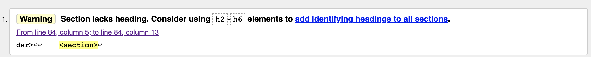
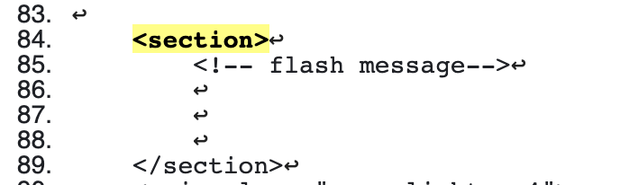

### Functionality Testing

* Navbar
    * Navigation Links operating as they should be and correct Nav Links displaying.

* Recipe Cards
    * Anchor links takes you to the appropriate recipe decription.
    * Image expands to full screen on click.

* Search
    * All search functionality working displaying correct flag/recipes/country title.

* Profile
    * Displays correct recipes depending on session user.
    * Admin all recipes displayed.

* Add Recipe/Edit Recipe
    * All fields required working.
    * Recipes add/edit to the database all working.

* Buttons/Font Awesome social links
    * Feedback all working appropriately.

* Sign In/Sign Up
    * All working, if username exists or password incorrect, flash messages displayed.

* Sign Out 
    * All working.

### Responsive Design Testing

* The website has been viewed on a variety of devices through chrome dev tools such as Desktop, Laptop, iPhone 6/7/8, moto g4 &ipad/ipad mini all functioning correctly and responsive.
* Tested on Google Chrome & Mozilla Firefox Browsers all functioning correctly.

### Lighthouse Report Testing

- Home Page Desktop and Mobile

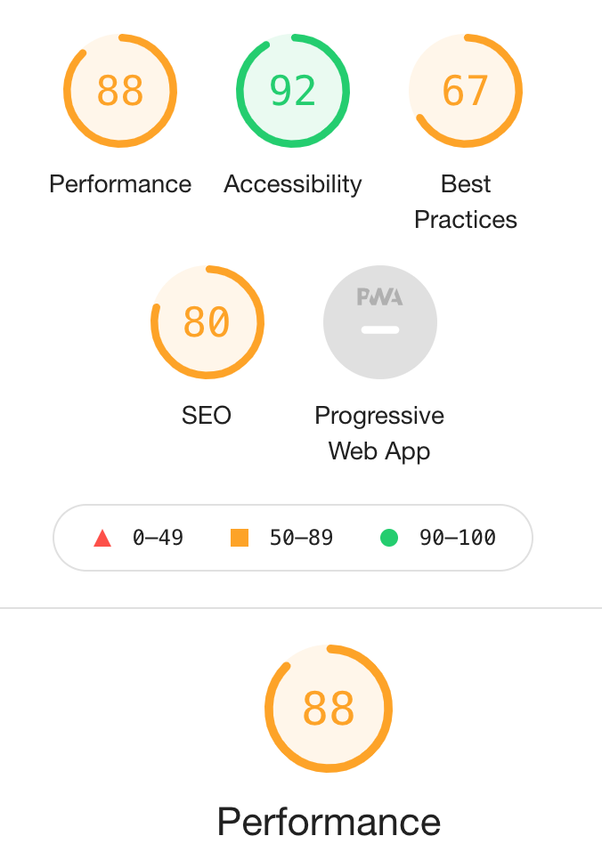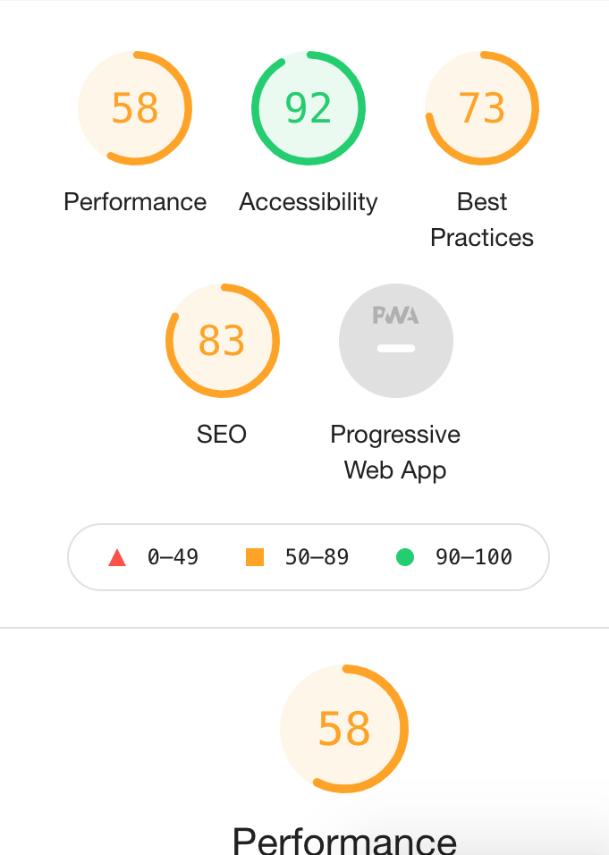

- Recipes Page Desktop and Mobile

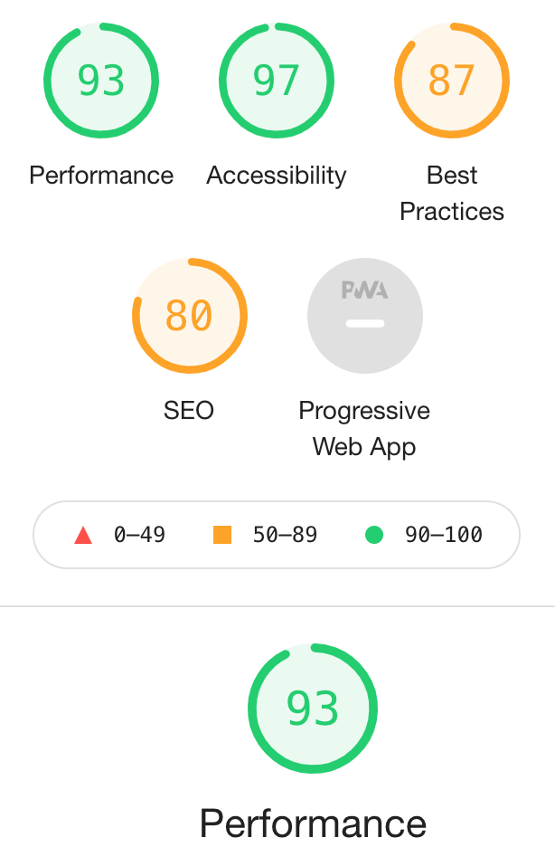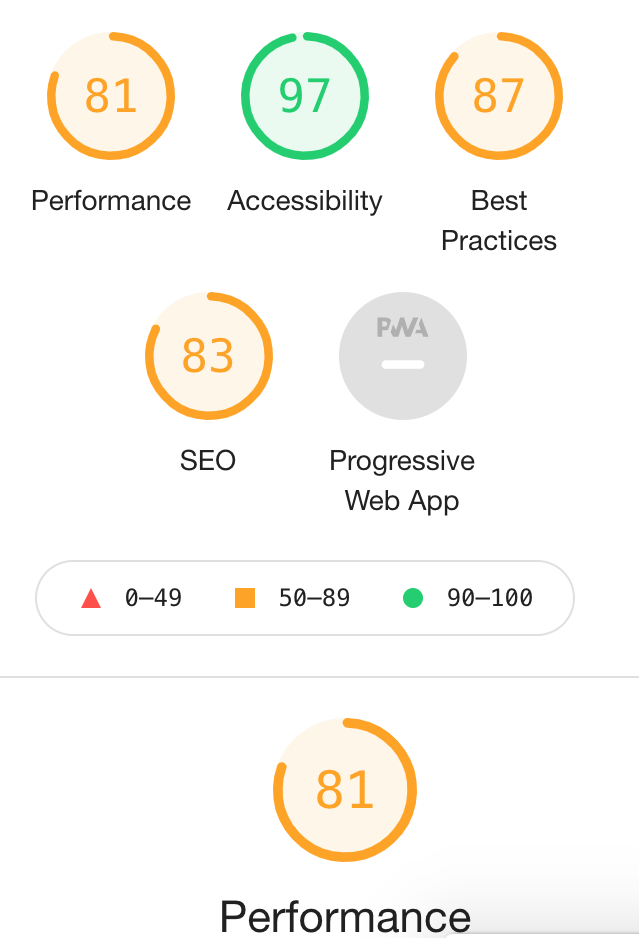

- Sign In Page Desktop and Mobile

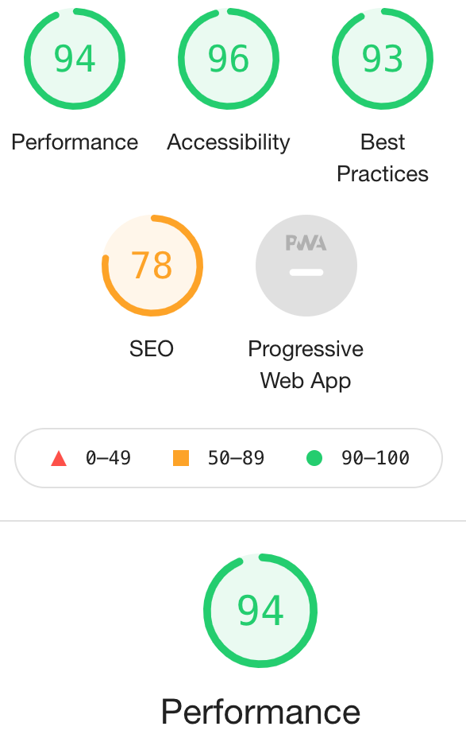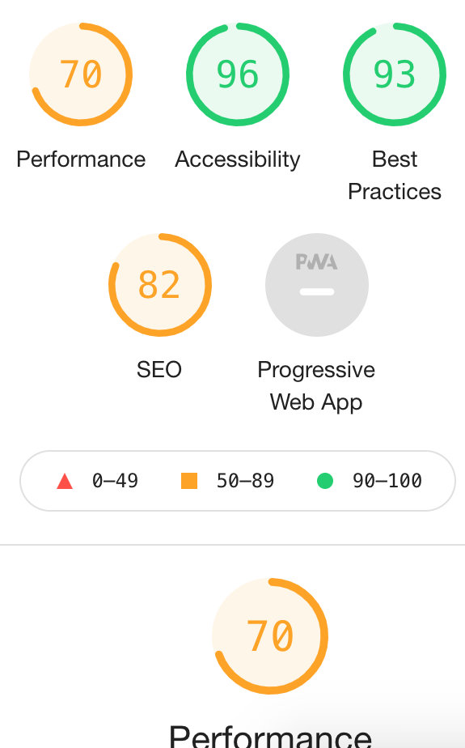

- Signup Page Desktop and Mobile

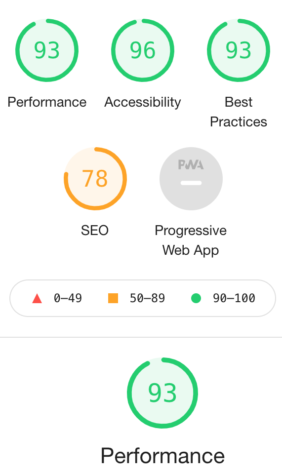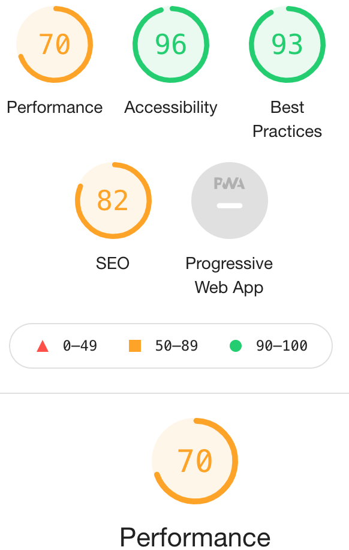

- Profile Page Desktop and Mobile

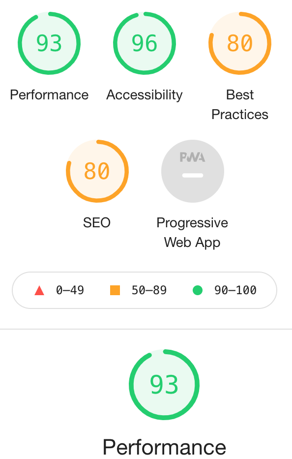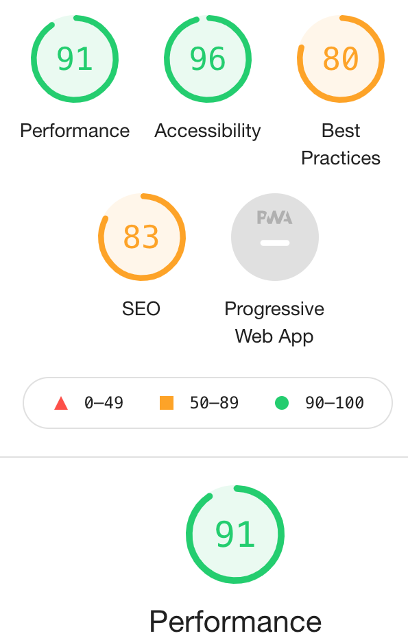

- Recipe Description Page Desktop and Mobile

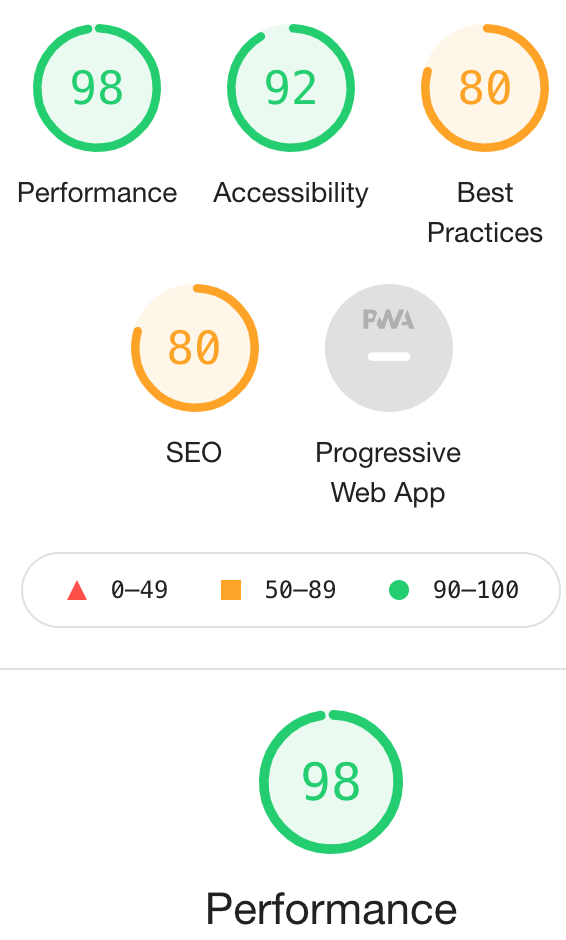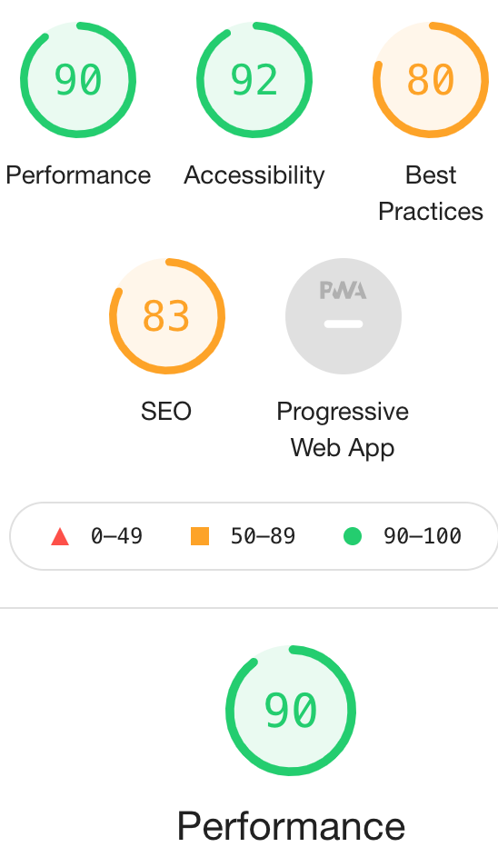

- Add Recipe Page Desktop and Mobile
   
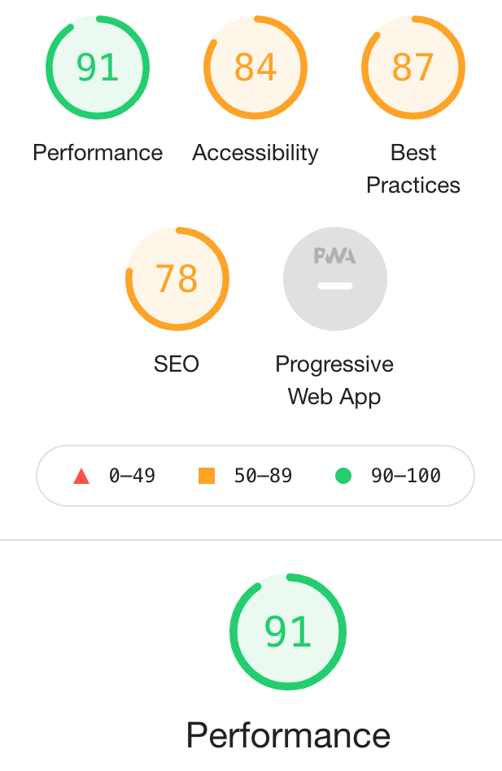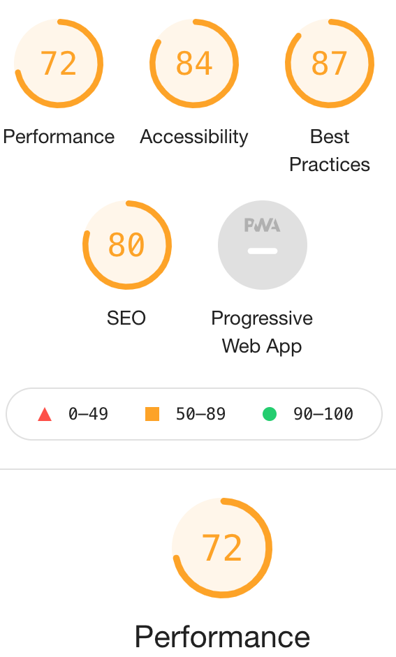

- Edit Recipe Page Desktop and Mobile
   
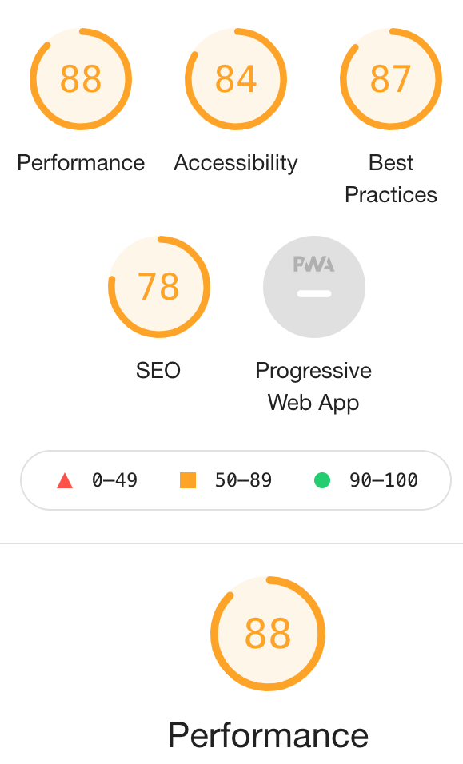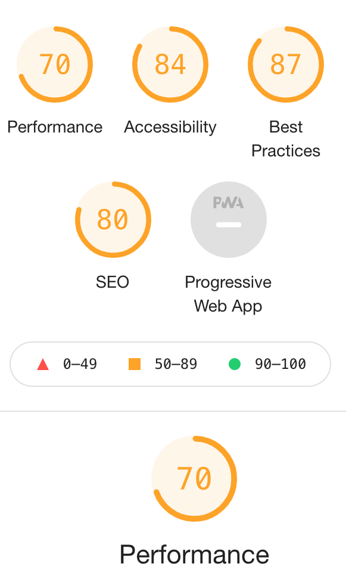

## Encountered Issues

* White Space at the bottom of the page on home page due to Carousel Item overflowing beyond footer. Set overflow to hidden to resolve.

```
.carousel-position {
    margin: 0 auto;
    overflow: hidden;
}
```

* When deleting a recipe through the modal, first recipe in the jinja loop was deleting rather then selected recipe. Data Target & ID matched to fix the issue.

```
<button data-target="{{ recipe._id }}" class="btn-small red darken-1 text-shadow modal-trigger">Delete</button>
                    <!-- Modal Structure -->
                    <div id="{{ recipe._id }}" class="modal">
```

* All recipes were not displaying when selecting all within recipes dropdown navigation. Else statement added if country == "south east asia"  to find all recipes from the mongodb. Line 166 app.py file.

```
else:
        """If country is south east asia display all recipes"""
        if country == "south east asia":
            recipes = list(mongo.db.recipes.find())
```

### Bugs

* Carousel between footer & Carousel white space occasionally appears. However this a rare occurance.

## Deployment

### Working with the local copy
  1. Install all the requirements: Go to the workspace of your local copy. In the terminal window of your IDE type: pip3 install -r requirements.txt.
  2. Create a database in MongoDB:
     * Signup or login to your MongoDB.
     * Create a cluster and a database.
     * Create collections for your application - users & recipes.
  3. Create the environment variables:
     * Create a .gitignore file in the root directory of the project.
     * Add the env.py file in the .gitignore.
     * Create the file env.py. This will contain all the environment variables.
        * Import os
        * os.environ.setdefault("IP", "Added by developer")
        * os.environ.setdefault("PORT", "Added by developer")
        * os.environ.setdefault("SECRET_KEY", "Added by developer")
        * os.environ.setdefault("MONGO_URI", "Added by developer")
        * os.environ.setdefault("MONGO_DBNAME", "Added by developer")
  4. Run the app: Open your terminal window in your IDE. Type python3 app.py and run the app.

  **Env.py file is included within the .gitignore file as they are private and can't be disclosed for security reasons.**
  
### Heroku Deployment
  1. Set up a local workspace for Heroku:
     * In terminal of your IDE type: pip3 freeze -- local > requirements.txt. (The file is needed for Heroku to know which files to install.)
     * In terminal of your IDE type: python app.py > Procfile (The file is needed for Heroku to know which file is needed as an entry point.)
  2. Set up Heroku: create a Heroku account and create a new app and select your region:
  3. Deployment method 'Github':
     * Click on the Connect to GitHub section in the deploy tab in Heroku.
       * Search your repository to connect with it.
       * When your repository appears click on connect to connect your repository with the Heroku.
     * Go to the settings app in Heroku and go to Config Vars. Click on Reveal Config Vars.
       * Enter the variables contained in your env.py file (IP, PORT, SECRET_KEY, MONGO_URI, MONGO_DBNAME).
  4. Push the requirements.txt and Procfile to the repository:
     * $ git add requirements.txt
     * $ git commit -m "Add requirements.txt"
     * $ git add Procfile 
     * $ git commit -m "Add Procfile"
  5. Automatic deployment: Go to the deploy tab in Heroku and scroll down to Automatic deployments. Click on Enable Automatic Deploys. By Manual deploy click on Deploy Branch.

  Heroku will receive the code from Github and host the app using the required packages. Click on Open app in the right corner of your Heroku account. The app wil open and the live link is available from the address bar. 

### Forking
  If you wish to contribute to this website you can Fork it without affecting the main branch by following the procedure outlined below:
  1. Go to the GitHub website and log in.
  2. Locate the [Repository](https://github.com/lukehanson2429/southeast-feasts) used for this project.
  3. On the right-hand side of the Repository name, you'll see the 'Fork' button. 
  4. This will create a copy in your personal repository.
  5. Once you're finished making changes you can locate the 'New Pull Request' button just above the file listing in the original repository.

### Cloning 
  If you wish to clone or download this repository to your local device you can follow the procedure outlined below.
  1. Go to the GitHub website and log in.
  2. Locate the [Repository](https://github.com/lukehanson2429/southeast-feasts) used for this project.
  3. Under the Repository name locate 'Clone or Download' button in green.
  4. To clone the repository using HTTPS click the link under "Clone with HTTPS".
  5. Open your Terminal and go to a directory where you want the cloned directory to be copied in.
  6. Type `Git Clone` and paste the URL you copied from the GitHub.
  7. To create your local clone press `Enter`

## Credits

### Content

* Recipes from BBC.
    * [Tofu Fritters](https://www.bbcgoodfood.com/recipes/burmese-tofu-fritters-tohu-jaw)
    * [Nasi Lemak](https://www.bbc.co.uk/food/recipes/nasi_lemak_58791)
    * [Nasi Goreng](https://www.bbc.co.uk/food/recipes/nasi_goreng_69542)
    * [Fish Amok](https://www.bbc.co.uk/food/recipes/nasi_goreng_69542)
    * [Cheat's Sausage Larb](https://www.bbcgoodfood.com/recipes/cheats-sausage-larb)
    * [Pork Adobo](https://www.bbcgoodfood.com/recipes/pork-caramelised-pineapple-adobo)
    * [Singapore Noodles](https://www.bbcgoodfood.com/recipes/singapore-noodles-0)
    * [Pad Thai](https://www.bbc.co.uk/food/recipes/pad_thai_36788)
    * [Beef Pho](https://www.bbcgoodfood.com/recipes/beef-pho)

* All other content written by developer.

### Code

* Flask Mini Project helpful guideline for project.
* W3C Schools/StackOverflow.

### Media 

* [Home Page - Banner](https://unsplash.com/photos/yAz5rCf87H8)
* [Home Page - Logo](https://www.pngwing.com/en/free-png-vueyh)
* Recipe Cards URL images BBC Good Food.
* [Home Page - Share](https://unsplash.com/photos/sedJnjrUMM8)
* [Home Page - Discover](https://unsplash.com/photos/Y11iTVE2DFA)
* Home Page Carousel Flags from Wikipedia.
* [Edit/Add Recipe Page - Background](https://unsplash.com/photos/eDDYpOEdyiA)
* [SignIn/Up Page & Error Pages - Background](https://unsplash.com/photos/QidLrJWXL0o)


### Acknowledgements

My Mentor Medale Oluwafemi has been very helpful with Feedback/Guidance.

Slack community for feedback & suggestions.

Code institute with supportive content and Tutor Support.